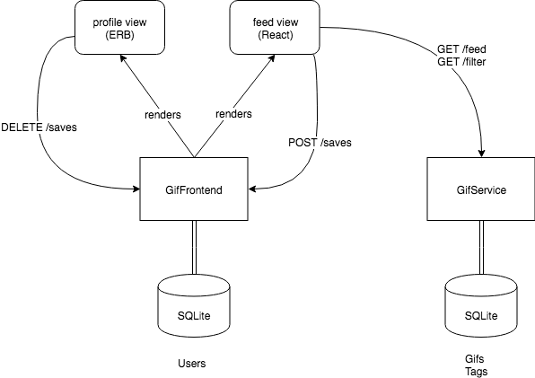

# Introduction
This project is a take-home challenge designed to evaluate full stack developers who are interested in working at Dovetale. 

It is structured as two basic Rails applications:
* GifService - a REST API service that returns GIFs
* GifFrontend - a web application that allows users to view and save GIFs

The GifFrontend application consists of two views, "feed" and "profile", which are rendered differently: 
* the "feed" view renders a React app
* the "profile" view renders HTML using a standard Rails ERB template

The diagram below can help with understanding how the applications are structured and how they should end up interacting. Some of these interactions do not exist yet and will be implemented throughout the exercises.

This setup may seem a bit unusual, but it was designed this way to evaluate the use of both React and Rails view templates. It also
represents how our own web app has evolved into a hybrid of React and Rails views.

Each application has its own SQLite database.
GifFrontend currently has one model: Users.
GifService currently has two models: Gifs and Tags.
The exercises will involve creating additional database tables and models to support the desired functionality.

Authentication for Users has already been implemented using the Clearance gem, so you will be able to sign up new Users and login as existing Users.

**Please read the instructions carefully when completing the excercises below**. If you get stuck or anything is unclear, please feel free to reach out to us.

# Prerequisites
To run the application you'll need the following:
* ruby (https://www.ruby-lang.org/en/documentation/installation/)
* node (version 8, newer versions aren't supported by yarn, https://nodejs.org/en/download/)
* yarn (https://yarnpkg.com/lang/en/docs/install/)

# Getting Started
1. Clone this repository to your local machine
2. Install the project dependencies for GifFrontend: `cd` into the GifFrontend directory and run `yarn install`
3. Install the Foreman gem: run `gem install foreman`
4. Install dependencies for each application: `cd` into each directory and run `bundle install`
5. Run the database migrations for each application.
6. Start both applications: `cd` to the project root directory and run `foreman start`
7. The GifService API will be running at http://localhost:3001
8. The GifFrontend application will be running at http://localhost:3000
9. Navigate to http://localhost:3000 in your browser

# Exercises

GifService
1. The GifService database is empty, so you'll need to seed it with some GIFs. Fortunately, `seeds.rb` already contains a script to them, all you have to do is run it! (reminder: there is a `rake` command for this)
2. Implement a many-to-many relationship between the Gifs model and the Tags model so that you can start associating Tags to Gifs.
3. There is an `after_create` callback on the Gif model called `create_tags`. Implement this method so that it creates Tags for the created Gif based on its title (you could split the title into individual words or match words from a specific list of tags). To test your method, either reseed the database with `seeds.rb` or use the rails console to manually run `create_tags` for each Gif.
4. The GifsController has an `index` action that retrieves all of the Gifs. Implement the JBuilder view for this action so that it returns the id, title and url for each Gif.
5. Create a new action in the GifsController that accepts a single param named "tag". This action should fetch all Gifs that match the given "tag" and render them using the same JBuilder view that the `index` action uses, update this view to include all of the tags associated with each Gif. Make use of the Tags table when searching rather than just using the title attribute on the Gifs table.

GifFrontend
1. Update the React app on the "feed" view to make a request to the GifService API to retrieve all Gifs when it first mounts. Show each of the Gifs on the "feed" page along with each of the tags that are associated to them. Style the view however you like! 
2. Add a search bar to the React app on the "feed" view. The search bar should hit the GifService API to retrieve any Gifs matching the search query (using the action from GifService exercise #5) and then show only those Gifs on the view.
3. Create a new SavedGif model in the GifFrontend application (including a new database table), which will be used to store any "saved" Gifs. Add an association between Users and SavedGifs. When creating the migration for this new table, keep in mind that there will be no association between the SavedGifs and Gifs models as they live on separate databases, so any data will need to replicated on the SavedGif model. 
4. Create a button for each GIF on the "feed" view that allows a User to save a GIF. This button should hit a new route on the GifFrontend application to save the GIF, not the GifService API.
5. Update the "profile" view to show any GIFs that a User has saved. Add a button to each saved GIF to allow a User to remove a saved GIF from their profile.

# Submission

Please submit the updated repository containing the completed exercises as a single zip file.